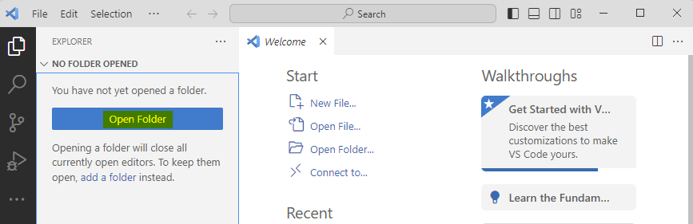
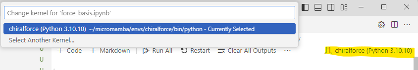

# ChiralForce

This repository contains a Python script `fields.py` together with two interactive Jupyter notebooks:
* `force_basis.ipynb` capable of reproducing twelve plots of force densities for any material parameters and for any mode near a cylindrical dielectric fibre 
* `particles.ipynb` capable of calculating and ploting the force fields for spherical chiral particles

## Dependencies
This code requires python package manager such as Anaconda, Miniconda or Micromamba and packages listed in the file environment.yaml. These packages are namely:
* astropy
* jupyter
* matplotlib (version 3.7)
* numpy
* python (version 3.10.10)
* scipy
* tqdm
* texlive (UNIX) or miktex (Windows)

## Setting up the environment
* Install [Miniconda](https://docs.conda.io/projects/miniconda/en/latest/miniconda-install.html) (or equivalent) and when finished open Anaconda Prompt
* Run the following command in the directory containing yaml file replacing word `environment` with (`unix`/`windows`): 
  ```
   conda env create -f environment.yaml
  ```
  this command creates an environment called `chiralforce` and installs all the required packages.
* Now open your favourite IDE (Visual Studio Code, JupyterLab, …) 
  * When using anaconda navigator select the environment `chiralforce`
    
  * When using Visual Studio Code:
    * make sure to open the folder ChiralForce-main in the explorer 
    
    * choose the `chiralforce` kernel before running any notebook
    
* Open and run force_basis.ipynb or particles.ipynb  
